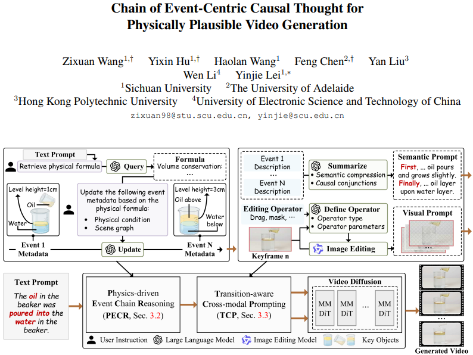

# Chain of Event-Centric Causal Thought for Physically Plausible Video Generation

This is the code repository related to [Chain of Event-Centric Causal Thought for Physically Plausible Video Generation](https://arxiv.org/pdf/2603.09094) (CVPR 2026, Poster) in PyTorch implementation.



## Citation

If it is helpful to your research, please cite our paper as follows:

```bibtex
@article{wang2026chain,
  title={Chain of Event-Centric Causal Thought for Physically Plausible Video Generation},
  author={Wang, Zixuan and Hu, Yixin and Wang, Haolan and Chen, Feng and Liu, Yan and Li, Wen and Lei, Yinjie},
  journal={arXiv preprint arXiv:2603.09094},
  year={2026}
}
```
